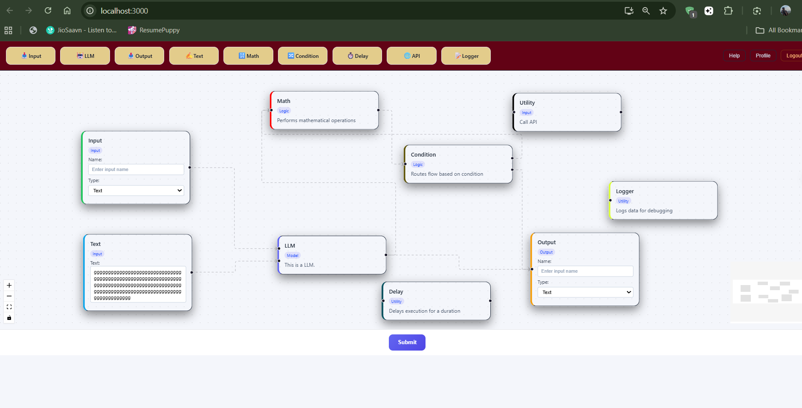
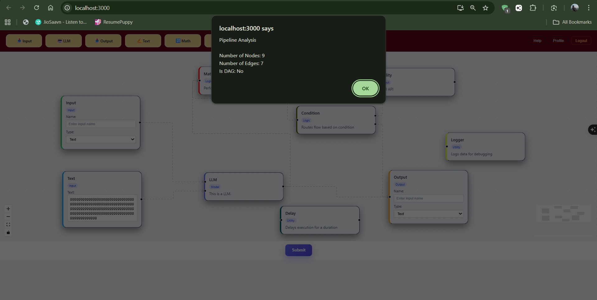
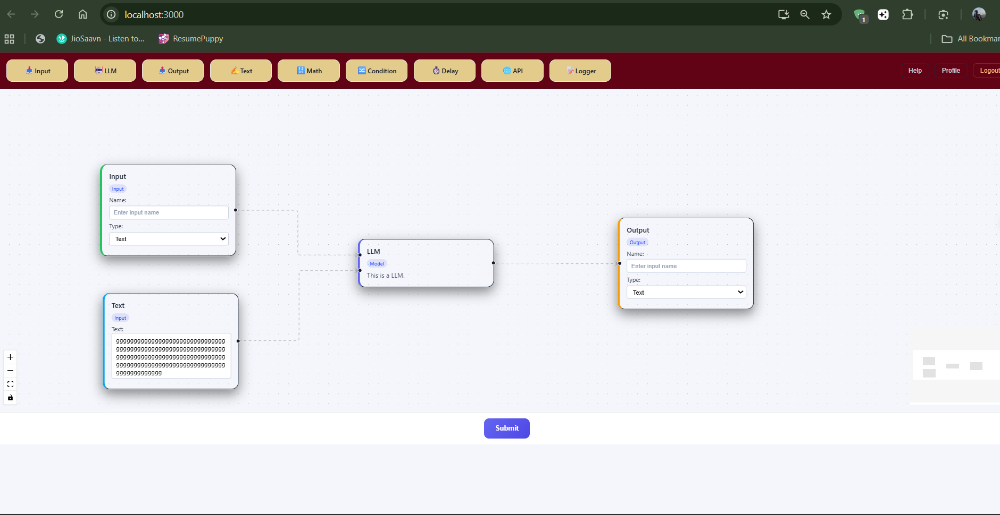
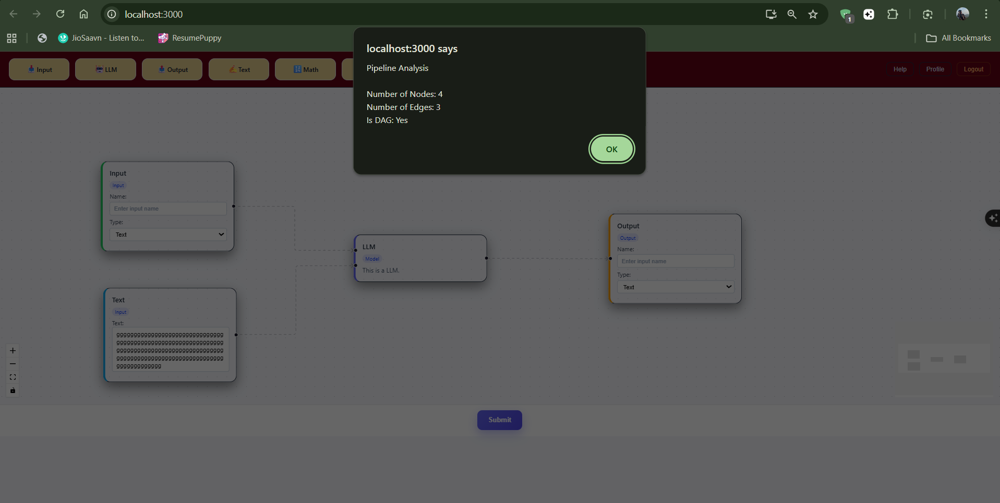

This repository contains my solution for the VectorShift frontend technical assessment.  
The goal of the assignment was to build a small but extensible pipeline editor using React for the frontend and FastAPI for the backend, with an emphasis on clean abstractions, usability, and maintainable code.

---

## Project Overview

The application allows users to build a pipeline by dragging nodes onto a canvas, connecting them, and submitting the pipeline for validation. The frontend is built with **React + ReactFlow**, while the backend uses **FastAPI** to analyze the pipeline structure.

The focus was not just on making the application work, but on designing it in a way that would be easy to extend and maintain as more node types or features are added.

### folder Structure
```
VectorShift/
│
├── backend/
│ └── main.py # FastAPI backend for pipeline validation
│
└── frontend/
├── public/ # Static assets
│
├── src/
│ ├── nodes/ # All node components and BaseNode abstraction
│ │ ├── BaseNode.jsx
│ │ ├── inputNode.js
│ │ ├── outputNode.js
│ │ ├── llmNode.js
│ │ ├── textNode.js
│ │ ├── mathNode.js
│ │ ├── conditionNode.js
│ │ ├── delayNode.js
│ │ ├── apiNode.js
│ │ └── loggerNode.js
│ │
│ ├── App.jsx # Root application component
│ ├── ui.js # ReactFlow canvas and interactions
│ ├── toolbar.js # Node selection toolbar
│ ├── draggableNode.js # Draggable toolbar node UI
│ ├── submit.js # Submit button and backend integration
│ ├── store.js # Global state management (Zustand)
│ ├── index.css # Global styles
│ └── index.js # Application entry point
│
├── package.json
└── package-lock.json
```

---

## Running the Project

### Frontend
```
cd frontend
npm install
npm start
```

**Runs at: http://localhost:3000**
```
Backend
cd backend
uvicorn main:app --reload
```


**Runs at: http://localhost:8000**

## Part 1: Node Abstraction

One of the first problems addressed was the large amount of duplicated code across different node components. To solve this, a reusable BaseNode abstraction was introduced.

**What was done:**

- Created a BaseNode component to handle layout, handles, styling, and common behavior

- Refactored existing nodes (Input, Output, LLM, Text) to use this abstraction

Added five new node types to demonstrate scalability:

- Math

- Condition (with true/false outputs)

- Delay

- API

- Logger

This approach makes it easy to create new nodes without rewriting common logic.

## Part 2: Styling and UI Design

The initial UI had minimal styling, so effort was put into creating a clean and professional look similar to real workflow tools.

### Key UI improvements:

- Dark application shell with a lighter canvas workspace

- Modern toolbar layout for node selection

- Distinct visual styling for different node types

- Improved spacing, typography, and overall layout

- Node type badges (e.g., INPUT, LOGIC, TEXT) for quick recognition

The result is a unified design that remains simple and easy to use.

## Part 3: Text Node Logic

The Text node required additional functionality beyond basic input handling.

### Enhancements made:

- Text input automatically resizes as the user types

- Node layout updates correctly using ReactFlow’s useUpdateNodeInternals

- Variables written as {{variable}} are detected in real time

- Each detected variable creates a corresponding input handle on the node

This makes the Text node flexible and dynamic while keeping the implementation clean.

## Part 4: Backend Integration

The frontend is connected to a FastAPI backend to validate the pipeline structure.

### Backend workflow:

Frontend sends the list of nodes and edges on submit

### Backend counts:

- Total number of nodes

- Total number of edges

- Backend checks whether the pipeline forms a Directed Acyclic Graph (DAG)

- Results are returned and shown to the user in a friendly alert

CORS was configured to allow communication between the frontend and backend during development.

### Additional Enhancements

A few extra improvements were added to enhance usability without increasing complexity:

- Delete button on canvas nodes to remove nodes and their connections

- Empty canvas helper text guiding users to get started

- Icons in the toolbar for quicker node recognition

- Better placeholder behavior instead of pre-filled input values

- Conditional nodes with explicit true/false branching

These additions improve the user experience while staying within the scope of the assignment.

## Final Notes

This project fulfills all requirements of the VectorShift technical assessment and demonstrates:

- Component abstraction and reuse

- Dynamic UI behavior

- Clean frontend–backend integration

- Attention to UX and visual polish

The codebase is structured to be easy to understand, maintain, and extend.

## Images






## Author
**Ferrari Sohel**
***Full-Stack Developer***


